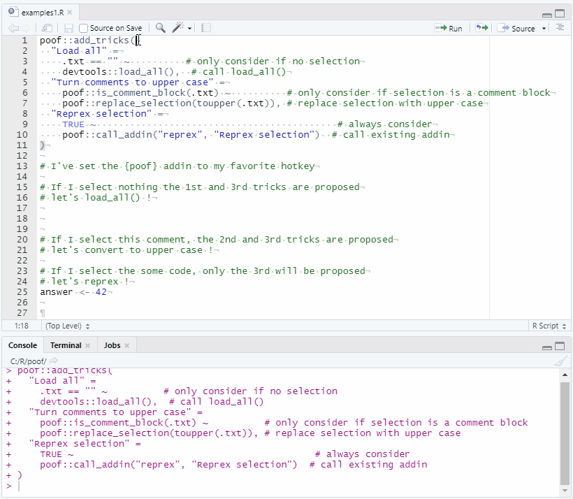
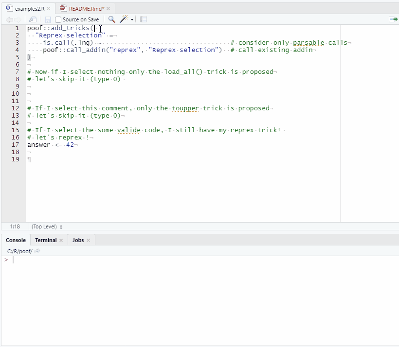

<!-- README.md is generated from README.Rmd. Please edit that file -->

# poof

RStudio addins are great but have flaws :

  - They’re contained in packages, which are not straightforward to
    write/iterate on
  - It’s hard to remember which addins you’ve installed, and harder to
    remember the hotkeys you’ve set for them
  - The addin list soon becomes overwhelming

So you don’t write them much, and you don’t use them much.

{poof} is an attempt to solve those issues:

  - It works with a single hotkey
  - Only relevant action choices are proposed, depending on what was
    selected in the editor
  - It’s made very easy to add actions
  - You can leverage existing installed addins

We don’t recommend attaching the package, the namespace notation
`poof::fun` will work fine and keep your workspace cleaner.

## Installation

``` r
remotes::install_github("moodymudskipper/poof")
```

## Examples

We call “tricks” the features implemented by {poof}, and use the
following syntax to define them :

    poof::add_tricks("<name1>" = <condition1> ~ <action1>, "<name2>" = <condition2> ~ <action2>, ...)

  - Each condition will be called on the selection and determine if the
    trick should be considered
  - Once a trick is selected, its action will be triggered

For example let’s set up 3 tricks :

  - run `devtools::load_all()`
  - turn comments to upper case
  - run a reprex on the selection, using the existing addin

<!-- end list -->

``` r
poof::add_tricks(
  "Load all" =
    .txt == "" ~           # only consider if no selection
    devtools::load_all(),  # call load_all()
  "Turn comments to upper case" =
    poof::is_comment_block(.txt) ~          # only consider if selection is a comment block
    poof::replace_selection(toupper(.txt)), # replace selection with upper case
  "Reprex selection" =
    TRUE ~                                          # always consider
    poof::call_addin("reprex", "Reprex selection")  # call existing addin
)
```



`poof::is_comment_block()` is a condition helper, there are more of them
and they’re documented in `?"condition-helpers"`.
`poof::replace_selection()` and `poof::call_addin()` are action helpers
and they’re documented in `?"action-helpers"`

`.txt` is the selected text, we can also use `.lng`, `.val` and `.sub`
on both sides of the formula :

  - `.lng` is the parsed expression, equivalent to `str2lang(.txt)`
  - `.val` is the value, equivalent to `eval(.lng)`
  - `.sub` is used to substitute the selection in the action

If the selection is not parsable, conditions that use `.lng`,or `.sub`
will return `FALSE`.

If the selection is not parsable, simple (see note at the bottom of this
section) and evaluable, conditions that use `.val` will return `FALSE`.

It might seem complex but it’s intuitive in practice. Let’s use `.lng`
to improve our reprex trick above. We don’t need the reprex trick all
the time but only if we selected a valid call, thus we can formulate it
this way :

``` r
poof::add_tricks(
  "Reprex selection" =
    is.call(.lng) ~                                 # consider only parsable calls
    poof::call_addin("reprex", "Reprex selection")  # call existing addin
)
```



And let’s illustrate `.val` and `.sub` with a last example, a trick to
`debugonce` the selected function :

  - We’d like the name of the item to depend on the selection so we use
    a glue string
  - It should be considered only when selecting a function so we’ll have
    a condition on the value `.val`
  - The action uses the function `debugonce()` which uses non standard
    evaluation, but this is made easy using `.sub`

<!-- end list -->

``` r
poof::add_tricks(
  "debugonce({.txt})" =  # use a glue string to have a dynamic item name
    is.function(.val) ~  # consider only selection that evaluates to a function 
    debugonce(.sub)      # run function, by substituting the selection in the action
)
```


Note:

Since the conditions are all evaluated for each trick each time the
addin is triggered we need to make sure these don’t have side effects
such as changing the environment or writing to disk. `.val` is dangerous
in this respect as it triggers the evaluation of the selection. For this
reason tricks containing `.val` in the selection are considered only if
the selection is a symbol or a call to `::`, `:::`, `$`, `[` or `[[`.

## Where are these tricks stored ?

They’re stored in the `"poof.tricks"` option which you can display with
`getOption("poof.tricks")` or `poof::show_tricks()`. We’ve shown how to
add tricks, you can also remove some by using `poof::rm_tricks()`.

You might want to place a `poof::add_tricks()` call in your R Profile,
or design your own custom function to call it.

## Some more examples ?

*Soon*
